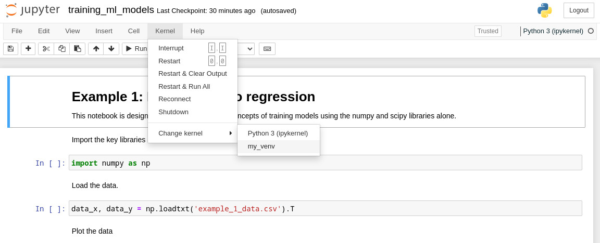

# Training ML Models

Thursday workshop at the [Institute of Computing for Climate Science Summer School 2022](https://cambridge-iccs.github.io/summerschool.html).

- Slides: [training_ml_models.pdf](training_ml_models.pdf)
- Notebook: [training_ml_models.ipynb](training_ml_models.ipynb)
- Script: [training_ml_models.py](training_ml_models.py)

# Download 

```bash
git clone https://github.com/handley-lab/2022-cambridge-iccs.git
cd 2022-cambridge-iccs
```

# Installation instructions
You will need to install
- notebook
- scikit-learn
- tensorflow
- pytorch
in that order -- you can leave the tensorflow/pytorch installation in the background until exercises 2 and 3 if downloads are slow.

All are pip-installable, which you should do either:
- via pip
- via conda
- via your system installation (`apt-get`, `yum`, `pacman`, etc) (none of these packages are controversial), 

The way that I do it when not using my arch system packages is with virtual environments:
```bash
python -m venv my_venv
source venv/bin/activate
pip install notebook scikit-learn tensorflow pytorch
python -m ipykernel install --user --name=my_venv
```
The final line tells the jupyter notebook where to look for the virtual environment.

# Run

Start the jupyter notebook
```bash
jupyter-notebook training_ml_models.ipynb
```
and select the virtual environment we've just installed



## FAQ
- How do I convert between notebooks and python scripts? [py2nb](https://github.com/williamjameshandley/py2nb)
- Why would I want to do that? [vimteractive](https://github.com/williamjameshandley/vimteractive)

